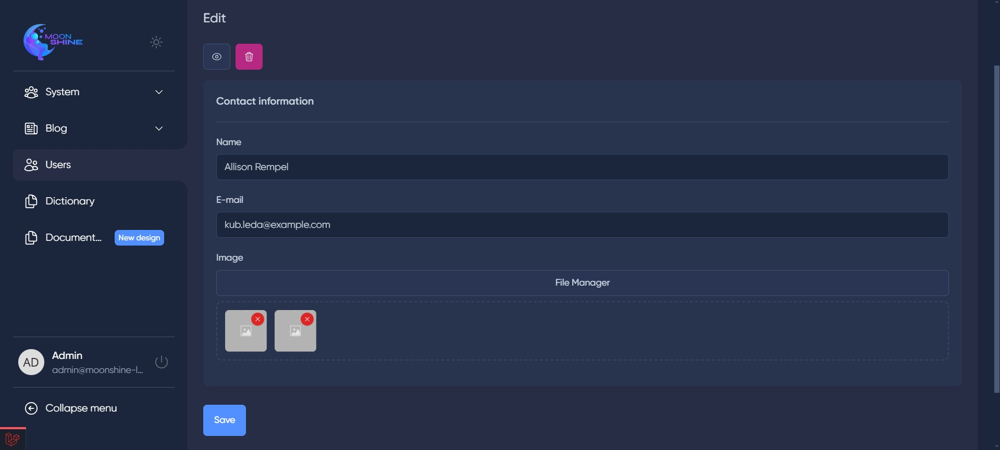
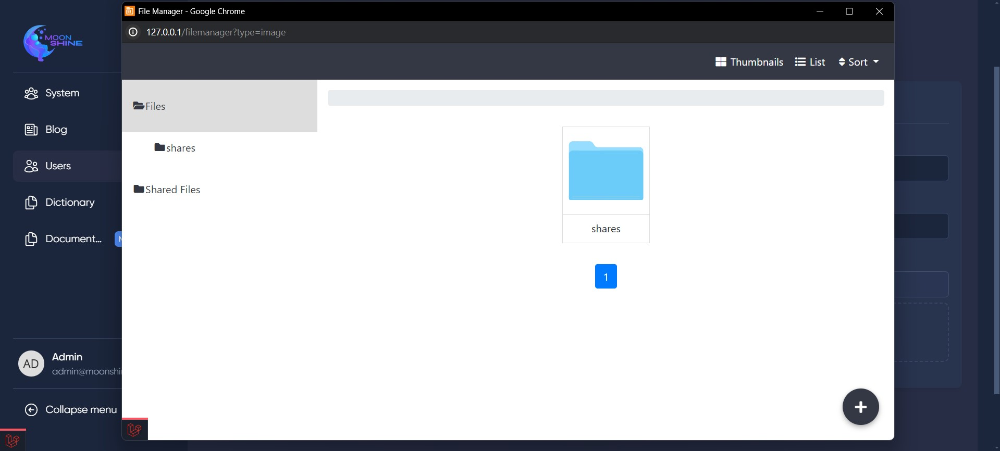

## MoonShine FileManager

### Description

This package is an extension exclusively designed for
the [MoonShine Admin Panel](https://github.com/moonshine-software/moonshine), building upon the functionality of
the [UniSharp Laravel FileManager](https://github.com/UniSharp/laravel-filemanager) package. This package introduces a
user-friendly interface for managing files and images, allowing admins to easily upload, organize, and handle media
directly within the admin panel.

<p align="center">
<a href="https://packagist.org/packages/sweet1s/moonshine-filemanager"></a>
<a href="https://packagist.org/packages/sweet1s/moonshine-filemanager"></a>
<a href="https://packagist.org/packages/sweet1s/moonshine-filemanager"></a>
</p>
<p align="center">
    <a href="https://laravel.com"></a>
    <a href="https://laravel.com"></a>
    <a href="https://github.com/moonshine-software/moonshine"></a>
</p>

---

> ### Requirements
> Moonshine: v2.0+
>
> UniSharp laravel-filemanager: v2.7+

---

## Features

-   [x] Intuitive File Management: Provides a simple and intuitive UI for managing files and images.
-   [x] Seamless Integration with Moonshine Admin Panel: Designed to integrate flawlessly with the Moonshine Admin
    Panel.
-   [x] Image Upload and Organization: Facilitates easy upload and organization of images.
-   [x] File Handling: Supports various file operations such as upload, delete, and rename.

---

## Installation

1. Install the [UniSharp Laravel FileManager](https://github.com/UniSharp/laravel-filemanager) package and follow the
   instructions in the [documentation](https://unisharp.github.io/laravel-filemanager/installation) to set up the
   package correctly.


2. Install the package via composer:

```bash
composer require sweet1s/moonshine-filemanager
```

---

## Usage

1. For Resource, add the following: **(In the screenshot you can see methods that can be used for File Manager, other
   methods that come from Field _File_ do not work.)**

```PHP
// ...
use Sweet1s\MoonshineFileManager\FileManager;
use Sweet1s\MoonshineFileManager\FileManagerTypeEnum;

class PostResource extends ModelResource
{
    public function fields(): array
    {
        return [
                Block::make('Contact information', [
                    // ...
                    FileManager::make('Image', 'images')
                        ->typeOfFileManager(FileManagerTypeEnum::File) // By default is FileManagerTypeEnum::Image
                        ->title('Media Manager') // By default, is 'File Manager'
                        ->allowedExtensions(['pdf', 'doc', 'txt']) // By default, all extensions are allowed
                        ->removable() // By default is false
            ]),
        ];
    }
}
```

---

#### _How does it look in the Admin Panel ?_



